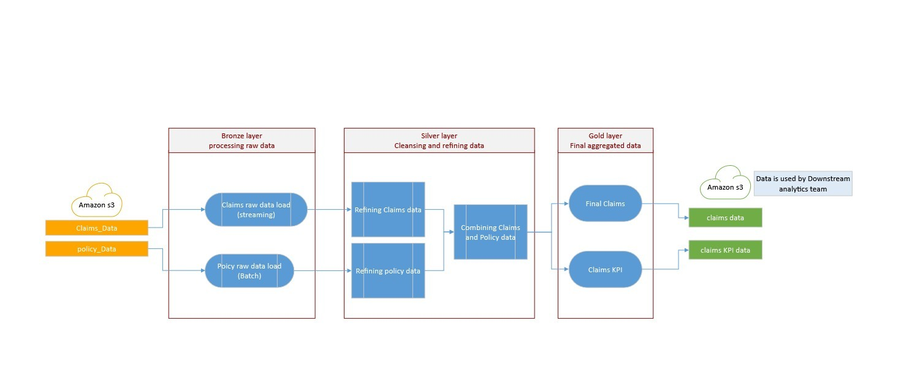
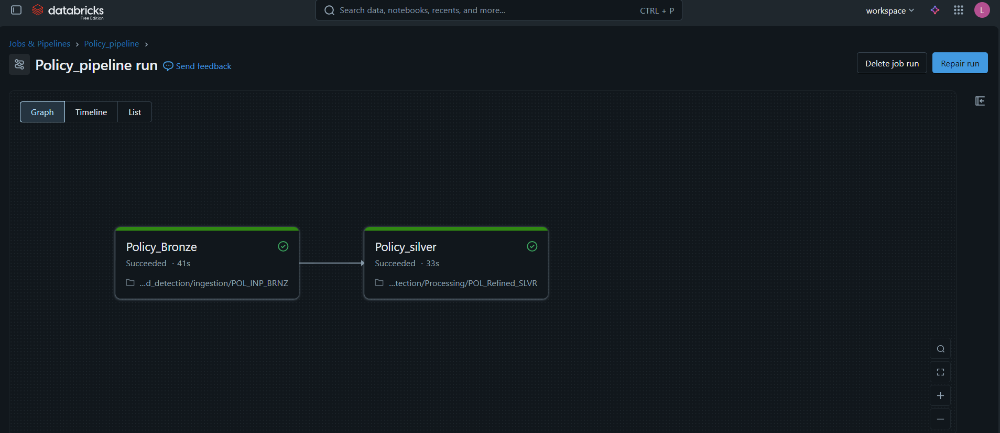
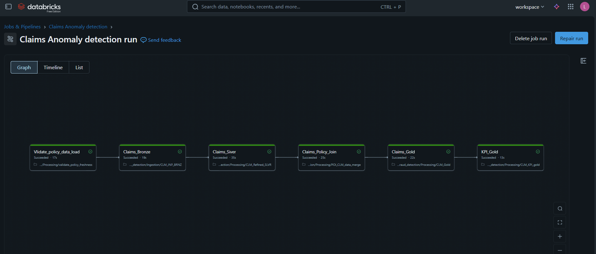
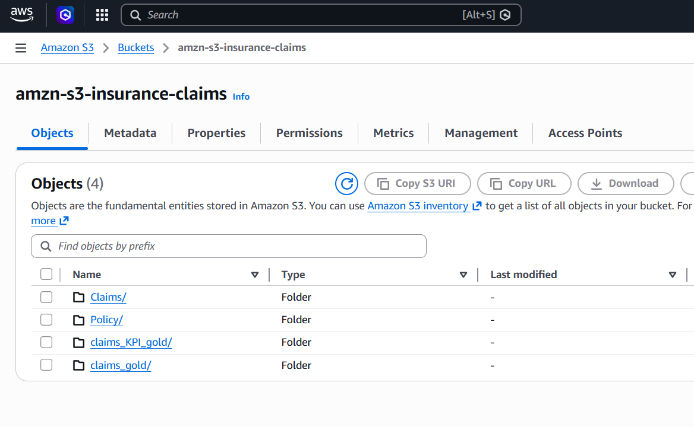
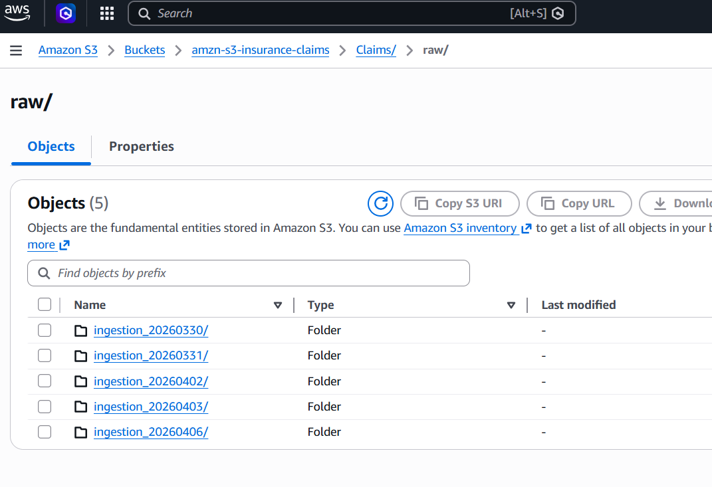
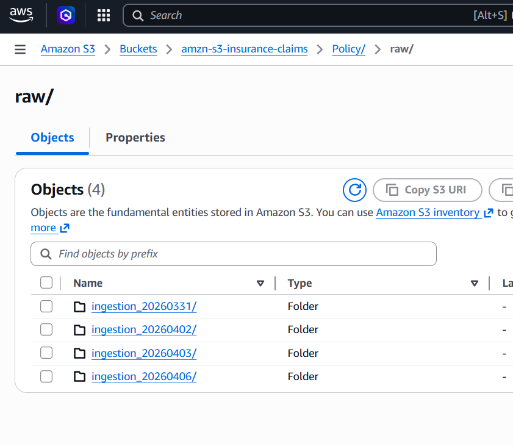
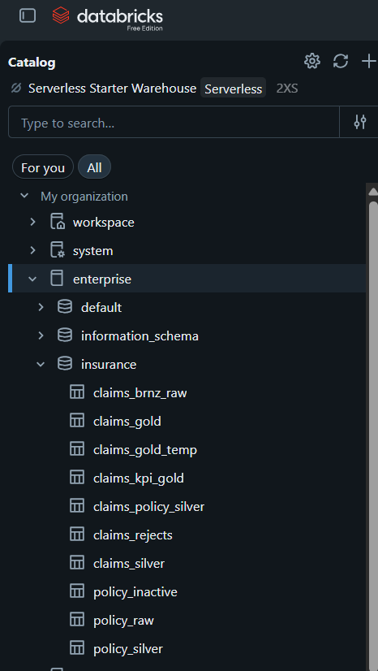

# 🚀 Intelligent Claims Anomaly Detection & Processing Platform (ICADP)

## 📌 Overview

This project simulates a real-world insurance data platform designed to process claims data using a hybrid **batch + streaming architecture**.

It demonstrates how modern data engineering systems handle:

* High-volume transactional data
* Data quality validation
* Fraud detection
* Scalable analytics pipelines

---

## 🧱 Architecture




📍 **Pipeline Flow**




```
Batch (Policy) → Bronze → Silver
Streaming (Claims) → Bronze → Silver
                     ↓
          Claims + Policy Join
                     ↓
                  Gold
                     ↓
                  KPI
                     ↓
          S3 (Parquet Export)
                     ↓
        Snowflake (Planned Consumption)
```

---

## ⚙️ Tech Stack

* Databricks (PySpark, Delta Lake, Workflows)
* AWS S3 (Data Lake)
* Snowflake (Serving Layer - Designed Integration)
* Python (Faker for synthetic data generation)

---

## 🔄 Pipeline Design

### 🔹 Policy Pipeline (Batch)

* Runs **once per day**
* Ingests policy data from S3
* Processes Bronze → Silver

### 🔹 Claims Pipeline (Streaming Simulation)

* Runs **every 10 minutes**
* Uses Auto Loader for incremental ingestion
* Processes Bronze → Silver → Gold → KPI

### 🔹 Data Freshness Validation

* Ensures policy data is updated before claims processing
* Prevents stale joins

---

## 🧠 Key Features

✔ Medallion Architecture (Bronze → Silver → Gold)
✔ Streaming + Batch Hybrid Design
✔ Data Quality Validation & Reject Handling
✔ Deduplication using Window Functions
✔ Fraud Detection Logic (Rule-Based)
✔ KPI Aggregation Layer
✔ Idempotent Pipelines using Delta MERGE
✔ Orchestration using Databricks Workflows
✔ Data Lineage Tracking
✔ Decoupled Pipeline Architecture

---

## 🚨 Problem Statement

Insurance systems often face:

* Duplicate claims processing
* Delayed fraud detection
* Poor data quality

This project addresses these challenges with a scalable and reliable data pipeline.

---

## 📊 Output Tables

### 🔹 Gold Layer

* `enterprise.insurance.claims_gold_temp`
* `enterprise.insurance.claims_kpi_gold`

### 🔹 Serving Layer (Simulated)

* Exported curated data to S3 (Parquet format)

---

## ❄️ Snowflake Integration (Design)

Due to Databricks free-tier limitations, direct Snowflake write could not be executed.

However, the pipeline is designed to:

* Export Gold data as Parquet to S3
* Use Snowflake External Stage + COPY INTO for ingestion

📍 Planned Flow:

```
Databricks → S3 (Parquet) → Snowflake
```

---

## 📁 Repository Structure









---

## 🧪 Data Simulation

* Synthetic claims and policy data generated using Faker
* Includes:

  * Duplicate records
  * Fraud patterns
  * Invalid data for testing

---

## 📌 How to Run

1. Upload data to S3
2. Run Policy Job (Daily)
3. Run Claims Job (Streaming simulation)
4. Validate outputs in Gold tables

---

## 🚀 Future Enhancements

* Real-time ingestion using Kafka
* ML-based fraud detection
* Power BI / Tableau dashboard integration
* Full Snowflake integration

---

## 👨‍💻 Author

**Anil kuamr Kanchamreddy**
📍 <https://www.linkedin.com/in/anil-kumar-kanchamreddy/>
📍 <https://github.com/anilkumarkanchamreddy>
